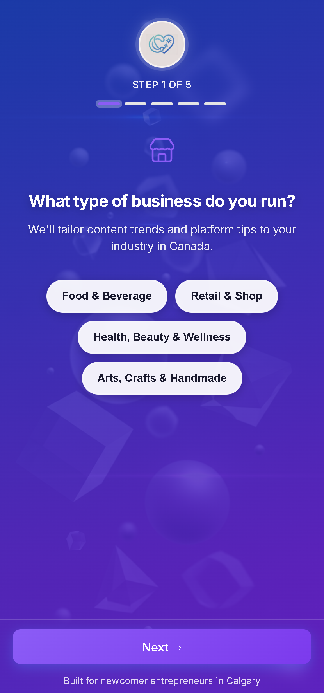
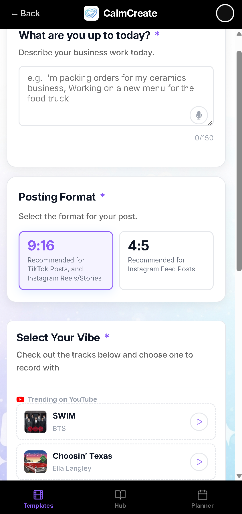
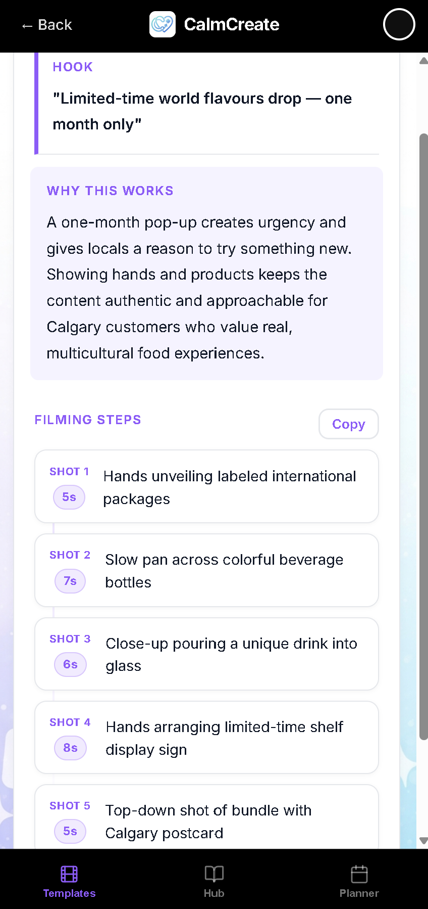
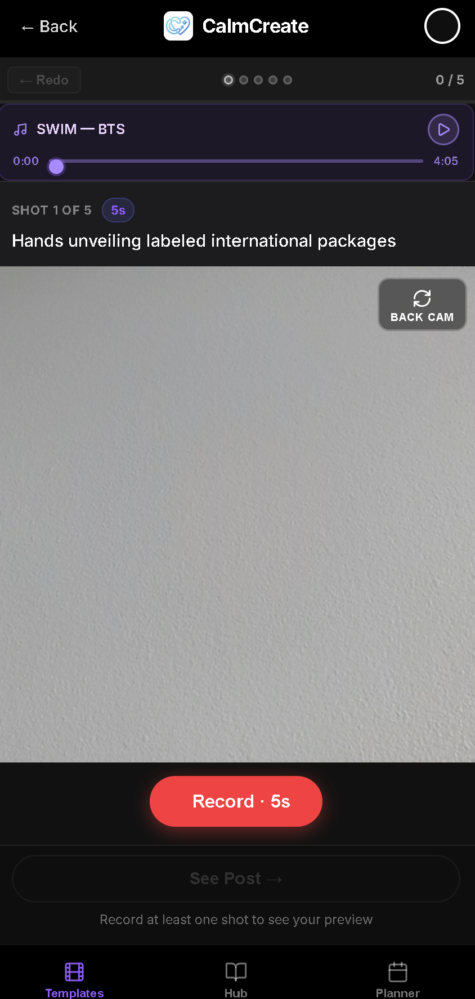

# CalmCreate

  
  


> **Note:** This is a prototype application developed for academic purposes. Some features (e.g., posting, billing, analytics, and music integration) are simulated and not connected to live platform APIs.

> Due to copyright and licensing requirements, trending audio can be referenced but not fully integrated into ready-to-post content. Full functionality requires platform-level licensing agreements and compliance with platform approval processes.

> CalmCreate would support seamless posting, real-time trend synchronization, and full integration of licensed audio through appropriate platform partnerships.

CalmCreate is an AI-powered social media content application designed to help newcomer entrepreneurs in Canada create short-form content with clarity, confidence, and consistency. It guides users from idea to execution through structured, step-by-step support that reduces uncertainty and enables action.

---

## Table of contents

- [Overview](#overview)  
- [Problem](#problem)  
- [Solution](#solution)  
- [Target users](#target-users)  
- [Core workflow](#core-workflow)  
- [How to use the application](#how-to-use-the-application)  
- [Features](#features)  
- [Implementation status](#implementation-status)  
- [Development process](#development-process)  
- [Challenges and learnings](#challenges-and-learnings)  
- [Technology stack](#technology-stack)  
- [Installation and setup](#installation-and-setup)  
- [Known limitations](#known-limitations)  
- [Example output](#example-output)  
- [Screenshots](#screenshots)  
- [Future improvements](#future-improvements)  
- [License](#license)  
- [Team](#team)  

---

## Live application

[Open CalmCreate (demo)](https://279f5d98-0236-4142-b67d-ee60b61efbd9-00-3fbd5vj7e3yi7.janeway.replit.dev/)

---

## Video walkthrough (≤ 7 minutes)

[Watch the demo (≤ 7 minutes)](https://youtu.be/vAZzZGJAFCk)

---

## Overview

CalmCreate addresses a key challenge in digital entrepreneurship: many individuals are motivated to build a business or personal brand but lack the direction and clarity needed to execute effectively. The application focuses on helping users move from uncertainty to consistent action in content creation.

---

## Problem

Newcomer entrepreneurs in Canada often face challenges that go beyond simply starting a business — they must navigate an unfamiliar digital and cultural environment.

Key challenges include:

- Uncertainty about what content works in the Canadian market  
- Cultural hesitation and fear of posting something inappropriate  
- Not knowing how to film or structure content  
- Inconsistent posting habits  
- Overthinking content decisions  
- Eventual lack of action despite strong intentions  

Without structure and feedback, users hesitate, second-guess their ideas, and often stop creating content altogether. The core issue is not effort — it is a lack of clarity and confidence.

---

## Solution

To address this gap, CalmCreate provides a guided, AI-assisted workflow that transforms simple inputs into clear, actionable steps.

The system:

- Learns user preferences such as business type and comfort level  
- Generates relevant content ideas aligned with user context  
- Converts a single input into a complete, ready-to-film content workflow  
- Provides captions, hashtags, and filming guidance  
- Guides users through execution from start to finish  

### Core value proposition

CalmCreate is a **decision-support and execution system**, not just a content generator. It reduces uncertainty, minimizes overthinking, and enables users to take consistent action in an unfamiliar digital environment.

---

## Target users

CalmCreate is designed for:

- Newcomer entrepreneurs in Canada  
- Individuals building a business or personal brand  
- Early-stage content creators  
- Users with limited experience in social media or marketing  

---

## Core workflow

1. User signs in  
2. Enters business type and content idea  
3. Selects comfort level (face or faceless)  
4. Selects posting format  
5. Receives a structured content kit  
6. Follows guided filming instructions  
7. Uses camera guide for framing  
8. Reviews the generated output  
9. Copies caption and opens platform  

---

## How to use the application

1. Sign in to the application  
2. Enter your business type and content idea  
3. Choose your comfort level (on-camera or faceless)  
4. Select a posting format  
5. Review the generated content kit  
6. Follow the filming steps provided  
7. Copy the caption and post on your preferred platform  

---

## Features

### Content kit generation

Converts a single user input into a complete content workflow including:

- Content idea  
- Explanation of relevance  
- Script or B-roll plan  
- Caption  
- Hashtags  
- Filming checklist  

---

### Voice-to-content

Transforms user input into:

- A ready-to-use script, or  
- A structured B-roll shot plan  

---

### Platform-aware guidance

Adapts content based on platform requirements:

- TikTok  
- Instagram (reel, story, feed)  
- Facebook  

Adjustments include orientation, pacing, framing, and safe zones.

---

### Comfort-based creation

Supports both:

- On-camera content  
- Faceless content  

---

### Camera guide

Provides visual framing support and positioning guidance.  
Camera access requires user permission and a compatible browser environment.

---

### Simulated posting workflow

Allows users to:

- Copy captions  
- Open target platforms  
- Restart the workflow  

---

### Authentication and accounts

Supports:

- User sign-in  
- Session management  
- Profile access  

---

### Freemium model

- Free plan: 1 post per day  
- Premium plan: unlimited posts ($5.99/month)  

---

### Prompt recall

Stores recent inputs for 24 hours for reuse.

---

## Implementation status

### Implemented

- Content generation workflow  
- Platform-aware formatting  
- Camera guide interface  
- Authentication and sessions  
- Usage tracking  
- Prompt recall  
- Simulated posting  

### Simulated

- Platform publishing  
- Billing and subscriptions  
- Analytics  

### Planned

- Real-time trend detection  
- Scheduling automation  
- Templates and content planning tools  
- Advanced personalization  

---

## Development process

CalmCreate was developed using Replit alongside AI tools including ChatGPT, Copilot, and Gemini.

AI was used to:

- Generate React components  
- Implement workflow logic  
- Debug system issues and conflicts  

For example, modifying prompt logic occasionally impacted unrelated features, requiring iterative testing and refinement.

---

## Challenges and learnings

### Challenges

- AI requires constant refinement and precise instructions  
- Integration with external platforms is complex  
- Feature updates can introduce instability  
- Managing version control requires coordination  

### Key learnings

- Simplicity improves usability  
- Clear guidance reduces user friction  
- Small changes can affect system behavior  
- Continuous testing is essential  

---

## Technology stack

**Frontend:** React (Vite), JavaScript, HTML/CSS  
**Backend:** Node.js  
**Database:** PostgreSQL  
**Authentication:** OIDC (Replit environment)  
**Tools:** Replit, ChatGPT, GitHub  

---

## Installation and setup

```bash
git clone https://github.com/jamshedx7/CalmCreate.git
cd CalmCreate
npm install
npm run dev
```

---

## Known limitations

- Limited platform integration (manual posting required)
- Personalization is still improving
- AI may not fully capture cultural nuance
- Data privacy considerations as the platform scales
- Usage limits for free users
- No real-time trend detection
- Camera requires browser permission

---

## Example output

**Input:**  
“I’m overwhelmed with orders but grateful my business is growing.”

**Output includes:**
- Script or B-roll plan
- Caption
- Hashtags
- Filming steps

---

## Screenshots

### Login and authentication


### Onboarding – business type selection


### Onboarding – language preference


### Onboarding – content comfort level (on/off camera)


### Onboarding – target audience


### Onboarding – posting frequency


### Content input and configuration


### AI-generated content kit


### Camera guide and recording 


### Final output (ready-to-post)


---

## Future improvements

- AI-assisted video editing
- Performance insights and analytics
- Direct platform integration
- Content templates and planning tools
- Geographic expansion

---

## License

This project is licensed under the MIT License.  
See the LICENSE file for details.

---

## Team

- Feyre  
- Jamshed  
- Kadi  
- Mohit  
- Xiaolin  

*CoLLaborative development across frontend, backend, and AI integration.*

---

## Final statement

CalmCreate bridges the gap between thinking and doing. By transforming uncertainty into structured action, it enables users to consistently create, build confidence, and grow their digital presence over time.

---
